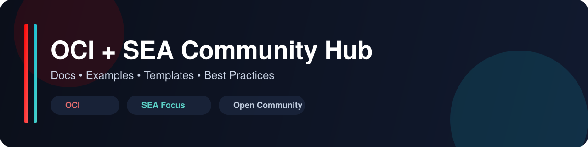

	

	
	
	
	

# OCI + SEA Community Hub

Repositorio comunitario para documentar, compartir y reutilizar contenido práctico sobre Oracle Cloud Infrastructure (OCI), con foco regional en Southeast Asia (SEA).

Este espacio busca convertir ideas en implementaciones reales, seguras y reproducibles.

## Resumen

Este repositorio centraliza:

- Guías paso a paso para arrancar más rápido.
- Buenas prácticas de arquitectura y operación en OCI.
- Ejemplos reproducibles con enfoque en limpieza de recursos.
- Plantillas para estandarizar documentación y proyectos.

## Navegación rápida

| Sección | Propósito | Enlace |
| --- | --- | --- |
| Documentación base | Guía inicial y fundamentos | [docs/getting-started.md](docs/getting-started.md) |
| Buenas prácticas | Recomendaciones operativas | [docs/best-practices/README.md](docs/best-practices/README.md) |
| Ejemplos Terraform | Casos de infraestructura como código | [examples/terraform/README.md](examples/terraform/README.md) |
| Ejemplos OCI CLI | Automatización por línea de comandos | [examples/cli/README.md](examples/cli/README.md) |
| Plantillas | Estructuras reutilizables | [templates/README.md](templates/README.md) |
| Contribución | Flujo para aportar al proyecto | [CONTRIBUTING.md](CONTRIBUTING.md) |

## Estructura del repositorio

| Carpeta | Qué contiene |
| --- | --- |
| docs/ | Guías, fundamentos y mejores prácticas |
| examples/ | Ejemplos por herramienta y escenario |
| templates/ | Plantillas base para nuevos aportes |
| .github/ | Templates de issues, PR y automatización CI |

## Inicio rápido

1. Revisa la guía de inicio en [docs/getting-started.md](docs/getting-started.md).
2. Elige un punto de partida en [templates/README.md](templates/README.md).
3. Ejecuta un ejemplo de [examples/terraform/README.md](examples/terraform/README.md) o [examples/cli/README.md](examples/cli/README.md).
4. Aplica limpieza al terminar para evitar costos innecesarios.

## Principios del proyecto

- Reproducibilidad antes que complejidad.
- Seguridad por defecto, sin exponer secretos.
- Claridad en costos y pasos de cleanup.
- Colaboración abierta y respetuosa.

## Contribuir

Las contribuciones son bienvenidas en documentación, ejemplos y templates.

Antes de abrir un PR:

1. Verifica que los pasos sean reproducibles.
2. Incluye instrucciones de cleanup o destroy.
3. Elimina cualquier secreto o dato sensible.
4. Sigue la guía de [CONTRIBUTING.md](CONTRIBUTING.md).

## Seguridad y cumplimiento

- Reporte y lineamientos de seguridad: [SECURITY.md](SECURITY.md).
- Código de conducta para la comunidad: [CODE_OF_CONDUCT.md](CODE_OF_CONDUCT.md).
- Alcance y limitaciones del proyecto: [DISCLAIMER.md](DISCLAIMER.md).

## Licencia

Este proyecto se distribuye bajo licencia MIT. Revisa [LICENSE](LICENSE).
